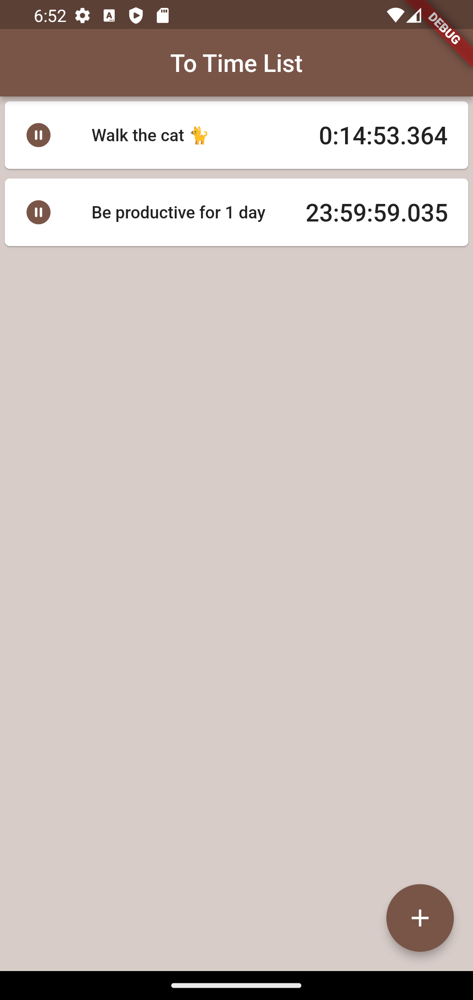
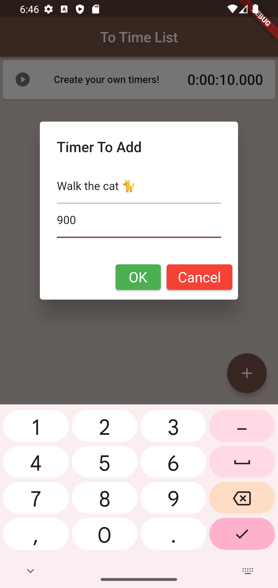
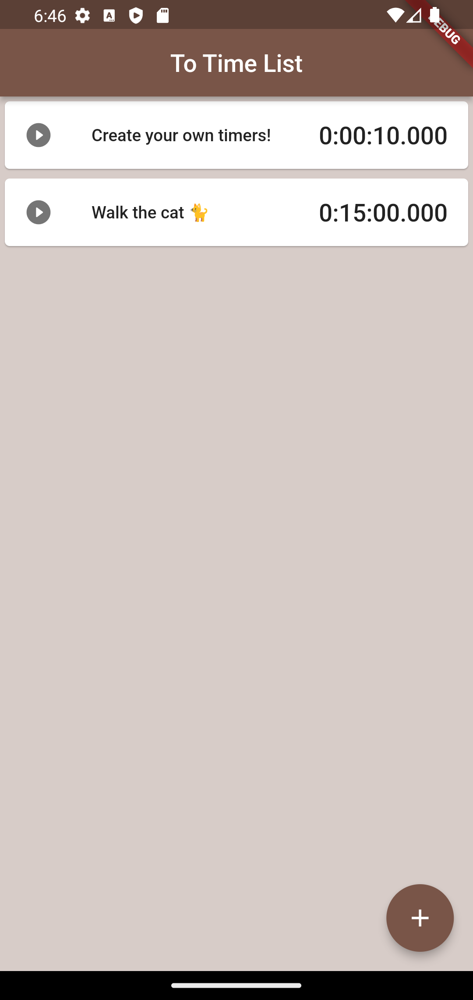

# To Time List

A Flutter app for creating and using several timers at once!

## Description

To Time List is a unique kind of to-do list that keeps track of not just which things to do, but also how much time you have to do them. Although most modern smartphones come preloaded with a timer app, To Time List outshines them mechanically and aesthetically.

## Instructions

1. On the app homepage, click the 'Add' icon in the bottom-right corner to open the 'Add Timer' page.
2. To add a timer, give it a name and a duration, then click OK.
    - **Note:** The duration is given in seconds and must be a whole number, but timers can be anywhere from 1 second to several days if desired!

3. The homepage will now include your new timer. To start or stop your timer, tap on it once. Timers are automatically removed once they finish counting, but if you wish to remove a timer before it finishes then long-tap it while it is paused.